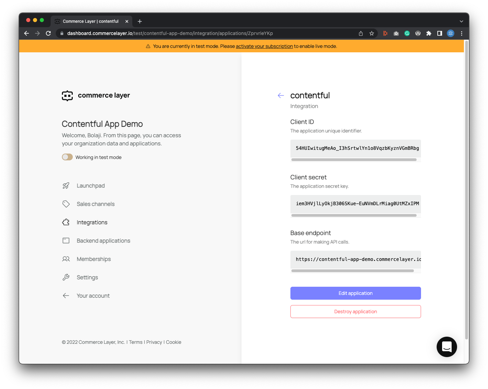

# Commerce Layer Contentful App

The Commerce Layer app lets content editors easily link Commerce Layer resources to content data in the Contentful dashboard.


## What is Commerce Layer?

[Commerce Layer](https://commercelayer.io) is a multi-market commerce API and order management system that lets you add global shopping capabilities to any website, mobile app, chatbot, wearable, voice, or IoT device, with ease. Compose your stack with the best-of-breed tools you already mastered and love. Make any experience shoppable, anywhere, through a blazing-fast, enterprise-grade, and secure API.

## Table of contents

- [App Features](#features)
- [Getting started](#getting-started)
- [Installation Guide](#installation-guide)
- [Contributors guide](#contributors-guide)
- [Help and support](#need-help)
- [License](#license)

## App Features

The current version of this app, allows you to:

- Full-text search for products in Contentful
- Preview selected products in Contentful
- Link one or more SKUs inside Contentful
- Link one or more SKU lists inside Contentful
- Link one or more markets inside Contentful
- Link one or more bundles inside Contentful

## Getting Started

1. Create a [Contentful account](https://www.contentful.com) if you haven't already and setup a new space for your project.

2. Create a [Commerce Layer account](https://dashboard.commercelayer.io/sign_up) if you haven't already.

3. If you haven't already, kindly follow this [onboarding guide](https://docs.commercelayer.io/developers) to learn how to set up your Commerce Layer organization, seed with demo data, and get your API credentials.

4. In the Commerce Layer dashboard, click on the **Integrations** tab and create an application, with the name: `contentful` and role: `Admin`. Upon successful creation, you'll get a `CLIENT ID`, `CLIENT SECRET`, and `BASE ENDPOINT`. Kindly remember to save these credentials as you'll need them later.



## Installation Guide

I need the app deployed to the Contentful marketplace so I can capture the actual installation flow before setup.

- Create a Contentful space
- Visit contentful marketplace
- Install the app to space
- Add CL credentials (read only admin)
- Select one or more resources to show in the field editor
- Save installation config
- Create a content model
- Create a content type
- Add a field with text field of type `Short text, exact search`
- Click "create and configure"
- Go to "Apperance" tab and Set to the Commerce Layer app
- Create a new content to test for each resource
- Link resource from CL to the content field
- Done!

## Contributors guide

This project was bootstrapped with [Create Contentful App](https://github.com/contentful/create-contentful-app) and uses [Reactjs](https://reactjs.org/), [Typescript](https://www.typescriptlang.org/), [App SDK](https://www.contentful.com/developers/docs/extensibility/app-framework/sdk/), and [Forma36](https://github.com/contentful/forma-36) design system. In the project directory, you can run perform the following actions using the attached commands:

1. Create or update your app definition in Contentful, and run the app in development mode in the browser. The page will reload if you make edits and you will also see any lint errors in the console.

```bash
npm start
```

2. Build the app for production to the `build` folder. It correctly bundles React in production mode and optimizes the build for the best performance.

```bash
npm run build
```

3. Upload the build folder to Contentful and create a bundle that is automatically activated. The command guides you through the [deployment process](https://www.contentful.com/developers/docs/extensibility/app-framework/create-contentful-app/#deploy-with-contentful) and asks for all required arguments.

```bash
npm run upload
```

4. Similar to `npm run upload` it will upload your app to Contentful and activate it. The only difference is that with this command all required arguments are read from the environment variables. For this command to work, the following environment variables must be set: 

- `CONTENTFUL_ORG_ID` - The ID of your organization
- `CONTENTFUL_APP_DEF_ID` - The ID of the app to which to add the bundle
- `CONTENTFUL_ACCESS_TOKEN` - A personal [access token](https://www.contentful.com/developers/docs/references/content-management-api/#/reference/personal-access-tokens)

```bash
npm run upload-ci
```

--- 

To contribue to this project, kindly follow the steps below:

1. Fork [this repository](https://github.com/commercelayer/contentful-app) (you can learn how to do this [here](https://help.github.com/articles/fork-a-repo)).

2. Clone the forked repository like so:

```bash
git clone https://github.com/<your username>/commercelayer/contentful-app.git && cd commercelayer/contentful-app
```

3. Set your environment with a `.env` file using `.env.sample` as base.

4. Install all required packages using the command `npm install`.

5. Run the development server on `localhost:3000` using the command `npm start`.

6. Contentful Apps need to run inside the Contentful web app to function properly. Install the app into a space and render your app into one of the available locations.

7. Create an [issue](https://github.com/commercelayer/contentful-app/issues) to discuss feature ideas or improvements before working on them.

8. Make your changes, test them, and create a pull request ([learn how to do this](https://docs.github.com/en/github/collaborating-with-issues-and-pull-requests/creating-a-pull-request)).

9. Someone will attend to your pull request and provide some feedback.

## Need help?

1. Join [Commerce Layer's Slack community](https://slack.commercelayer.app).

2. Create an [issue](https://github.com/commercelayer/commercelayer-react-checkout/issues) in this repository.

3. Ping us [on Twitter](https://twitter.com/commercelayer).

## License

This repository is published under the [MIT](LICENSE) license.
